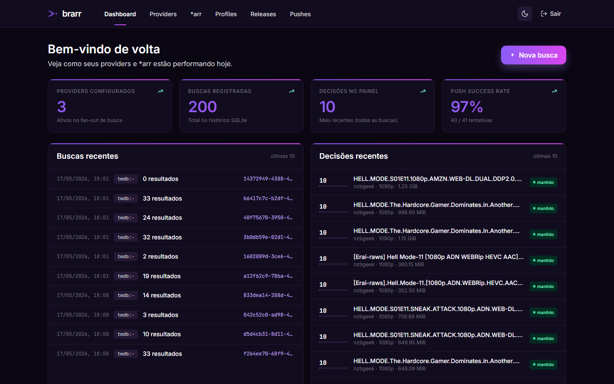
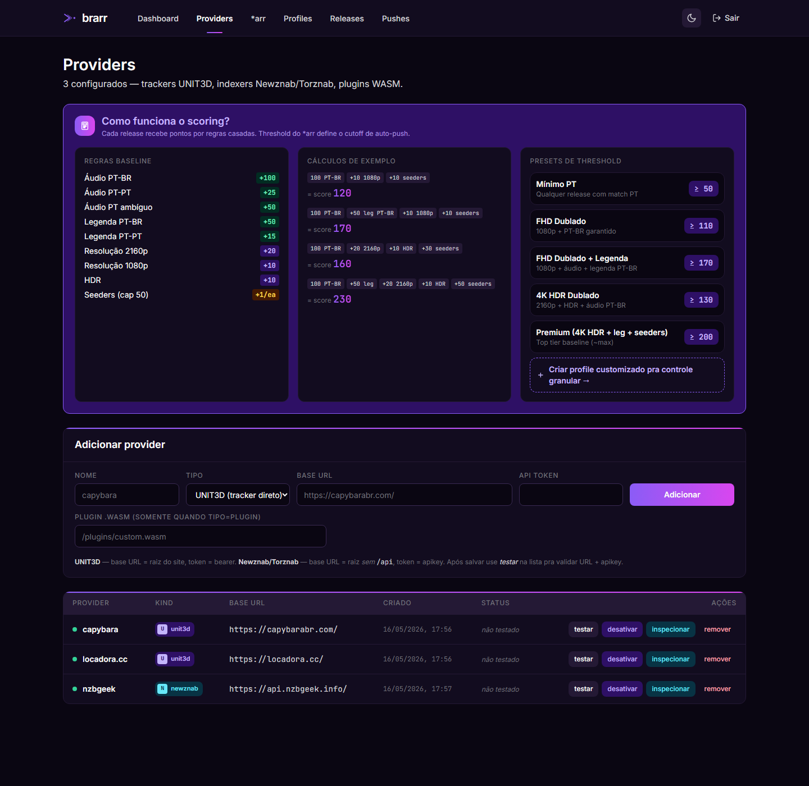
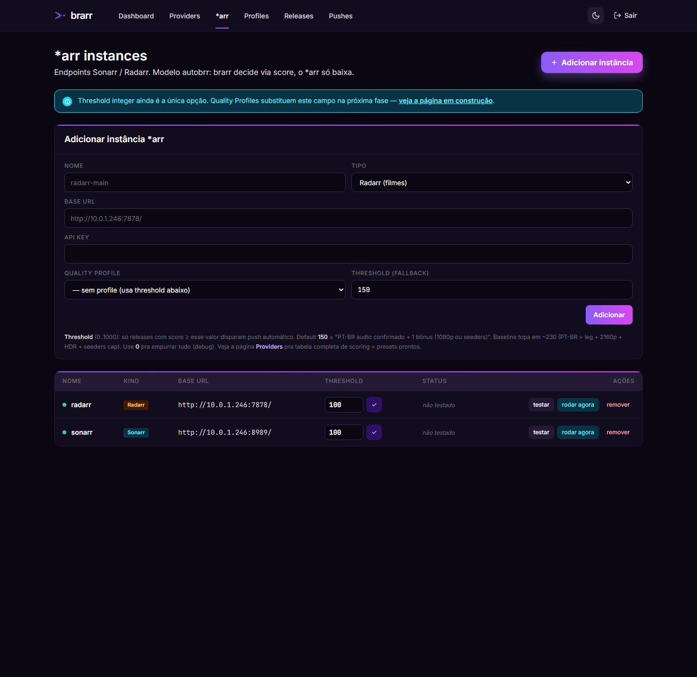
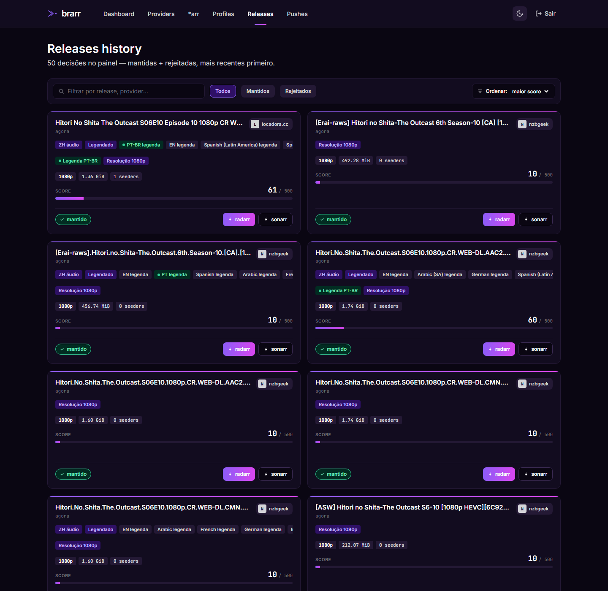
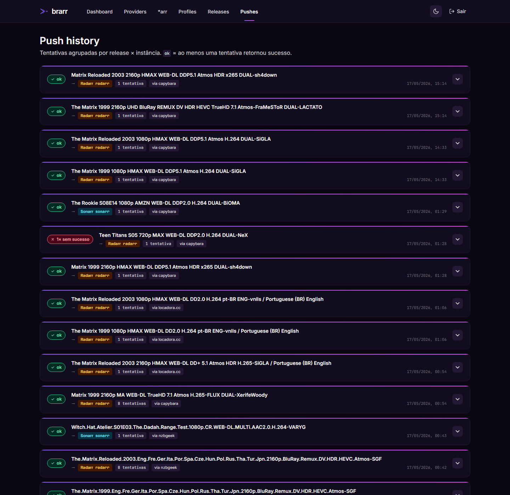
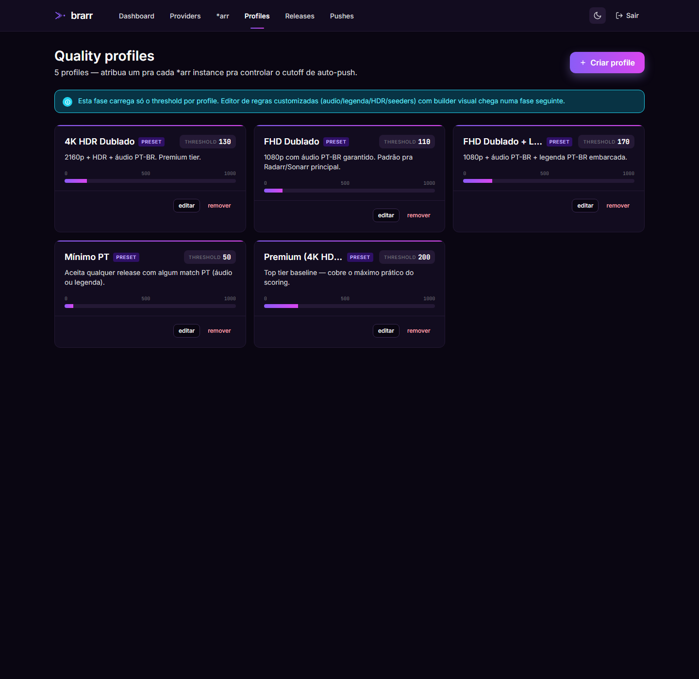
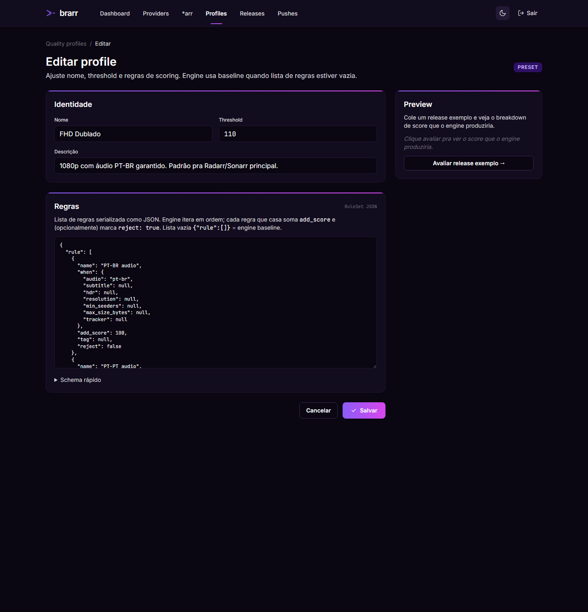
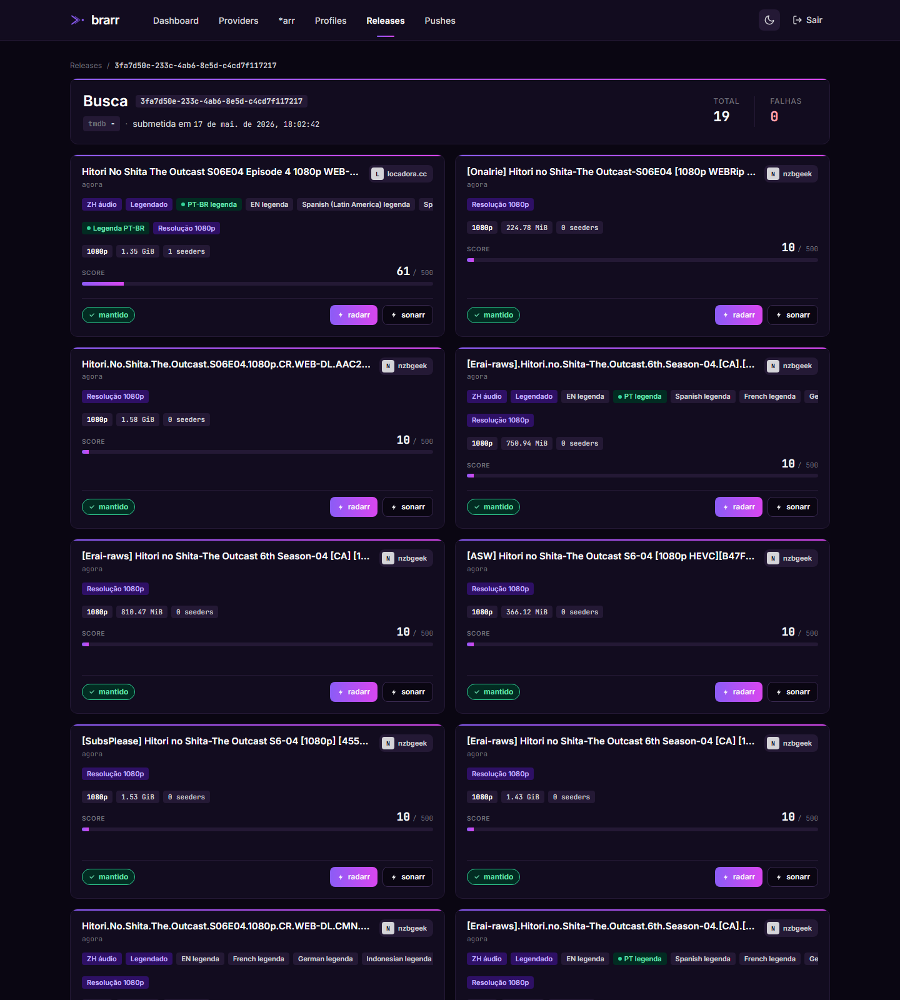

# brarr

> Portuguese-language torrent search aggregator across UNIT3D / Newznab /
> Torznab indexers. Fans out a search to every configured provider,
> scores each release by Portuguese audio + subtitle quality, and
> auto-pushes the best candidate to Sonarr / Radarr.
>
> Agregador de busca em trackers privados focado em mídia com áudio
> e legenda em português. Faz fan-out para todos os providers
> configurados, pontua cada release pela presença/qualidade de áudio
> e legenda PT, e empurra automaticamente o melhor candidato para
> Sonarr / Radarr.

[English](#english) · [Português](#português)

---

## English

### What it does

brarr is a personal autobrr-style automation: instead of Sonarr / Radarr
deciding what to grab, **brarr decides** based on a configurable rules
engine and pushes the chosen release downstream.

The full pipeline:

1. Operator (or a poll cycle against `*arr/wanted`) submits a search by
   TMDb / IMDb / TVDB id.
2. brarr fans out to every enabled provider — UNIT3D trackers, Newznab
   indexers, Torznab indexers, WASM plugins — in parallel.
3. Each returned release is normalised, parsed through `MediaInfo`, and
   scored by the rule engine. Default baseline rewards PT-BR audio
   (+100), PT-BR subtitles (+50), 1080p (+10), 2160p (+20), HDR (+10),
   and seeders (+1 each, capped at 50).
4. Decisions cross the configured threshold get pushed to Sonarr /
   Radarr via their `/api/v3/release/push` endpoint.
5. Every push attempt is recorded — successes, rejections, transport
   errors — so the operator can debug why a grab didn't land.

A Torznab endpoint (`/torznab/api`) lets a Sonarr or Radarr that doesn't
want the inversion talk to brarr as a single virtual indexer.

### Stack

- **Rust** (workspace, MSRV 1.85, `edition = "2024"`).
- **Axum** for HTTP, **tonic** for gRPC, **sqlx** + **SQLite** for state.
- **Askama** + **HTMX** + **Tailwind v4** for the admin UI — server-
  rendered, no SPA, no Node build pipeline at runtime.
- **wasmtime** for the plugin sandbox (epoch-interrupted, capability-
  gated `host_fetch` with allowed-hosts allowlist).

### Screenshots

#### Dashboard

The landing page summarises provider count, search count, decisions in
the panel, and push success rate. Two columns underneath show recent
searches and recent kept decisions with mini score bars.



#### Providers

UNIT3D / Newznab / Torznab / WASM plugin endpoints brarr fans out to on
each search. The scoring hint card on top explains the baseline rules
and ships ready-to-paste threshold presets so an operator never has to
read Rust source to plan a threshold.



#### \*arr instances

Sonarr / Radarr endpoints brarr pushes to. Each instance can attach a
Quality Profile (cutoff threshold + custom rules) or fall back to a bare
integer threshold.



#### Releases history

Every persisted decision — kept and rejected — in a 2-column card grid.
Client-side filters (Todos / Mantidos / Rejeitados) + sort dropdown.
Each card carries explicit `PT-BR áudio` / `Dublado` / `Legendado`
chips above the rule-matched chips so the operator can see what the
release actually has at a glance.



#### Push history

Push attempts grouped by release + \*arr target. Successes (green),
rejections (\*arr accepted HTTP 200 but no grab fired due to its own
quality profile mismatch — surfaced as a list), and transport errors
each get a distinct badge.



#### Quality profiles

Reusable scoring presets. Five baseline-equivalent presets ship with a
fresh install. Each card shows the cutoff threshold on a 0..1000 scale.
The "editar" button leads to the full editor.



#### Profile editor

The editor exposes name / description / threshold inputs and a textarea
holding the rule list as JSON. A schema cheat-sheet collapses under
`<details>`. The right column has a live preview that evaluates the
in-flight rules against three canonical fixtures (PT-BR dub, anime JP
+ leg PT, EN 2160p HDR) and returns a per-release score breakdown.



#### Search detail

A single search's full result set, kept + rejected, with per-instance
push buttons and a warning alert listing any provider failures.



### Quick start

#### Prerequisites

- **Rust** 1.85+ (rustup recommended).
- **Tailwind v4** standalone binary at `tools/tailwindcss.exe` (or
  `tools/tailwindcss` on Linux). Install with
  `scripts/install-tailwind.{ps1,sh}`.

#### Run locally

```powershell
# 1. Re-establish cargo PATH (Windows)
$env:Path = "C:\Users\pc\.cargo\bin;$env:Path"

# 2. Build the CSS bundle (runs Tailwind v4 → static/app.css)
powershell -ExecutionPolicy Bypass -File scripts/build-css.ps1

# 3. Optional: enable session auth
$env:BRARR_AUTH_TOKEN = "$(openssl rand -hex 32)"

# 4. Run the orchestrator (HTTP + gRPC)
cargo run -p brarr-orchestrator
# → http://127.0.0.1:3000  (admin UI)
# → 127.0.0.1:50051         (gRPC)
```

#### Environment variables

| Var | Default | Purpose |
|-----|---------|---------|
| `BRARR_DB_PATH` | `./brarr.db` | SQLite path. `:memory:` for ephemeral. |
| `BRARR_HTTP_ADDR` | `127.0.0.1:3000` | Admin UI bind. |
| `BRARR_GRPC_ADDR` | `127.0.0.1:50051` | gRPC bind. |
| `BRARR_STATIC_DIR` | `./crates/brarr-orchestrator/static` | Asset directory. |
| `BRARR_AUTH_TOKEN` | unset | When set, admin UI requires `/login` and gRPC requires `Authorization: Bearer <token>` metadata. When unset, dev mode logs a warning at startup and lets every request through. |

#### Docker

```bash
docker build -t brarr:latest .
docker run --rm \
  -p 127.0.0.1:3000:3000 -p 127.0.0.1:50051:50051 \
  -v brarr-data:/data -v "$PWD/plugins:/plugins:ro" \
  -e BRARR_AUTH_TOKEN="$(openssl rand -hex 32)" \
  brarr:latest
```

Or via compose: `docker compose -f docker-compose.prod.yml --env-file .env.prod up -d`.

### Build / Test / Lint

```bash
cargo build --workspace
cargo test --workspace --all-targets
cargo clippy --workspace --all-targets -- -D warnings
cargo fmt --all -- --check
```

All four pass on `master` with zero warnings.

### Engineering rules (non-negotiable)

- TDD with real fixtures in `tests/fixtures/`.
- **No `unwrap()` / `expect()`** outside `#[cfg(test)]`. Propagate `Result`.
- Errors: `thiserror` in libraries, `anyhow` in binaries. **No `Box<dyn Error>`**.
- Logging via `tracing` only. No `println!` / `eprintln!` except CLI user output.
- Newtypes for IDs, enums for closed sets. `Option<T>` for genuinely optional.
- No defensive `.clone()` — borrow first, clone only when ownership is required.
- English identifiers + `///` docs. Portuguese only for user-facing strings.
- Clippy `pedantic` enforced via `clippy.toml`.
- Conventional Commits (`feat:`, `fix:`, `refactor:`, `test:`, `docs:`, `chore:`).

### Project state

- ✅ **brarr-mediainfo** — MediaInfo text dumps → `ParsedMediaInfo`.
- ✅ **brarr-core** — shared domain types (`Release`, `Language`,
  `ReleaseEnrichment`, ID newtypes, `TrackerProvider` trait).
- ✅ **brarr-tracker-unit3d** — async UNIT3D client.
- ✅ **brarr-tracker-newznab** — Newznab / Torznab XML client with
  hand-rolled `quick-xml` parser.
- ✅ **brarr-cli** — `brarr search` + `brarr remote` subcommands.
- ✅ **brarr-decision-service** — declarative rules engine with
  serde-derived `RuleSet`.
- ✅ **brarr-orchestrator** — Axum HTTP + tonic gRPC + Askama / HTMX /
  Tailwind admin UI + SQLite. Auto-push pipeline + Torznab outbound
  endpoint. Quality Profile editor with live preview.
- ✅ **brarr-plugin-host** — wasmtime-backed sandbox for tracker
  plugins. Epoch-interrupted, capability-gated `host_fetch`.

### License

`MIT OR Apache-2.0`.

---

## Português

### O que faz

brarr é uma automação pessoal estilo autobrr: ao invés do Sonarr /
Radarr decidir o que pegar, **o brarr decide** com base num motor de
regras configurável e empurra o release escolhido para baixo.

Pipeline completo:

1. Operador (ou ciclo de poll contra `*arr/wanted`) submete uma busca
   por id TMDb / IMDb / TVDB.
2. brarr faz fan-out para todos os providers habilitados — trackers
   UNIT3D, indexers Newznab, indexers Torznab, plugins WASM — em
   paralelo.
3. Cada release retornado é normalizado, passa pelo parser de
   `MediaInfo`, e é pontuado pelo motor de regras. Baseline padrão
   recompensa áudio PT-BR (+100), legenda PT-BR (+50), 1080p (+10),
   2160p (+20), HDR (+10), e seeders (+1 cada, cap em 50).
4. Decisões que cruzam o threshold configurado são empurradas para
   Sonarr / Radarr via endpoint `/api/v3/release/push`.
5. Toda tentativa de push é registrada — sucessos, rejeições, erros
   de transporte — para o operador debugar por que um grab não rolou.

Endpoint Torznab (`/torznab/api`) deixa um Sonarr ou Radarr que não
quer a inversão falar com o brarr como indexer virtual único.

### Stack

- **Rust** (workspace, MSRV 1.85, `edition = "2024"`).
- **Axum** para HTTP, **tonic** para gRPC, **sqlx** + **SQLite** para estado.
- **Askama** + **HTMX** + **Tailwind v4** para UI admin — renderizada
  no servidor, sem SPA, sem pipeline Node em runtime.
- **wasmtime** para sandbox de plugins (epoch-interrupted, `host_fetch`
  capability-gated com allowlist de hosts permitidos).

### Capturas de tela

#### Dashboard

Página inicial mostra contagem de providers, contagem de buscas,
decisões no painel, e taxa de sucesso de push. Duas colunas embaixo
mostram buscas recentes e decisões mantidas recentes com mini barras
de score.


#### Providers

Endpoints UNIT3D / Newznab / Torznab / plugin WASM em que o brarr faz
fan-out a cada busca. Card de scoring no topo explica regras baseline
e traz presets prontos de threshold pra colar — operador não precisa
ler código Rust pra planejar um threshold.


#### Instâncias *arr

Endpoints Sonarr / Radarr para onde o brarr empurra. Cada instância
pode anexar um Quality Profile (threshold de cutoff + regras
customizadas) ou cair no threshold integer cru.


#### Histórico de releases

Toda decisão persistida — mantida e rejeitada — num grid de 2 colunas
de cards. Filtros client-side (Todos / Mantidos / Rejeitados) +
dropdown de ordenação. Cada card mostra chips explícitos `PT-BR áudio`
/ `Dublado` / `Legendado` acima dos chips de regras casadas — operador
vê o que o release tem na hora.


#### Histórico de pushes

Tentativas de push agrupadas por release + alvo \*arr. Sucessos
(verde), rejeições (\*arr aceitou HTTP 200 mas não pegou por causa do
próprio quality profile dele — lista os motivos), e erros de
transporte ganham badge distinto.


#### Quality profiles

Presets de scoring reutilizáveis. Cinco presets equivalentes ao
baseline acompanham a instalação. Cada card mostra o threshold de
cutoff numa escala 0..1000. Botão "editar" abre o editor completo.


#### Editor de profile

Editor expõe inputs de nome / descrição / threshold e um textarea
com a lista de regras em JSON. Schema cheat-sheet colapsado em
`<details>`. Coluna direita tem preview ao vivo que avalia as regras
em três fixtures canônicas (PT-BR dublado, anime JP + leg PT, EN
2160p HDR) e devolve um breakdown de score por release.


#### Detalhe da busca

Resultado completo de uma busca, mantidos + rejeitados, com botões de
push por instância e alerta com falhas de provider se houver.


### Início rápido

#### Pré-requisitos

- **Rust** 1.85+ (rustup recomendado).
- Binário standalone do **Tailwind v4** em `tools/tailwindcss.exe`
  (ou `tools/tailwindcss` no Linux). Instala com
  `scripts/install-tailwind.{ps1,sh}`.

#### Rodar local

```powershell
# 1. Restabelece PATH do cargo (Windows)
$env:Path = "C:\Users\pc\.cargo\bin;$env:Path"

# 2. Builda o bundle CSS (roda Tailwind v4 → static/app.css)
powershell -ExecutionPolicy Bypass -File scripts/build-css.ps1

# 3. Opcional: habilita auth de sessão
$env:BRARR_AUTH_TOKEN = "$(openssl rand -hex 32)"

# 4. Roda o orchestrator (HTTP + gRPC)
cargo run -p brarr-orchestrator
# → http://127.0.0.1:3000  (UI admin)
# → 127.0.0.1:50051         (gRPC)
```

#### Variáveis de ambiente

| Var | Default | Função |
|-----|---------|--------|
| `BRARR_DB_PATH` | `./brarr.db` | Caminho do SQLite. `:memory:` pra efêmero. |
| `BRARR_HTTP_ADDR` | `127.0.0.1:3000` | Bind da UI admin. |
| `BRARR_GRPC_ADDR` | `127.0.0.1:50051` | Bind do gRPC. |
| `BRARR_STATIC_DIR` | `./crates/brarr-orchestrator/static` | Diretório de assets. |
| `BRARR_AUTH_TOKEN` | sem default | Quando setada, UI admin exige `/login` e gRPC exige `Authorization: Bearer <token>`. Sem ela, modo dev loga um warning no startup e libera tudo. |

#### Docker

```bash
docker build -t brarr:latest .
docker run --rm \
  -p 127.0.0.1:3000:3000 -p 127.0.0.1:50051:50051 \
  -v brarr-data:/data -v "$PWD/plugins:/plugins:ro" \
  -e BRARR_AUTH_TOKEN="$(openssl rand -hex 32)" \
  brarr:latest
```

Ou via compose: `docker compose -f docker-compose.prod.yml --env-file .env.prod up -d`.

### Build / Test / Lint

```bash
cargo build --workspace
cargo test --workspace --all-targets
cargo clippy --workspace --all-targets -- -D warnings
cargo fmt --all -- --check
```

Os quatro passam em `master` com zero warnings.

### Regras de engenharia (não negociáveis)

- TDD com fixtures reais em `tests/fixtures/`.
- **Sem `unwrap()` / `expect()`** fora de `#[cfg(test)]`. Propague `Result`.
- Erros: `thiserror` em libs, `anyhow` em binários. **Sem `Box<dyn Error>`**.
- Logging via `tracing` apenas. Sem `println!` / `eprintln!` exceto saída CLI.
- Newtypes pra IDs, enums pra conjuntos fechados. `Option<T>` pra opcional real.
- Sem `.clone()` defensivo — borrow primeiro, clona só quando ownership exigir.
- Identificadores em inglês + docs `///`. Português só pra strings de usuário.
- Clippy `pedantic` via `clippy.toml`.
- Conventional Commits (`feat:`, `fix:`, `refactor:`, `test:`, `docs:`, `chore:`).

### Estado do projeto

- ✅ **brarr-mediainfo** — dumps textuais de MediaInfo → `ParsedMediaInfo`.
- ✅ **brarr-core** — tipos de domínio compartilhados (`Release`,
  `Language`, `ReleaseEnrichment`, newtypes de id, trait `TrackerProvider`).
- ✅ **brarr-tracker-unit3d** — cliente UNIT3D async.
- ✅ **brarr-tracker-newznab** — cliente Newznab / Torznab XML com
  parser `quick-xml` próprio.
- ✅ **brarr-cli** — subcomandos `brarr search` + `brarr remote`.
- ✅ **brarr-decision-service** — motor de regras declarativas com
  `RuleSet` derivando serde.
- ✅ **brarr-orchestrator** — HTTP Axum + gRPC tonic + UI admin Askama
  / HTMX / Tailwind + SQLite. Pipeline de auto-push + endpoint Torznab
  outbound. Editor de Quality Profile com preview ao vivo.
- ✅ **brarr-plugin-host** — sandbox wasmtime para plugins de tracker.
  Epoch-interrupted, `host_fetch` capability-gated.

### Licença

`MIT OR Apache-2.0`.
